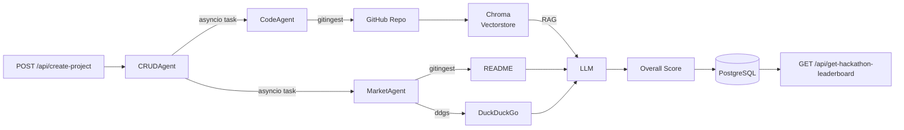

<div align="center">
  <h1 style="margin-bottom: 0.25rem;">Evalio</h1>
  <p style="margin-top: 0; color: #6b7280;">AI-powered hackathon evaluation platform — automated code analysis, market research, and LLM scoring.</p>
  <p>
    
    
    
  </p>
  <p>
    
    
    
    
  </p>
</div>

---

## Overview

Evalio is a full-stack evaluation engine for hackathons. It automates project scoring by combining static code analysis, live web research, and LLM reasoning — so judges spend time on decisions, not reading code.

- 🤖 **Code Agent** — ingests a GitHub repository via `gitingest`, builds a Chroma vector store from the source, and evaluates each hackathon criterion through RAG.
- 📊 **Market Agent** — fetches the project README and runs DuckDuckGo searches to assess market fit, competitors, and revenue potential.
- 🧮 **LLM Scoring** — after both agents complete, a final LLM pass synthesizes findings into a 0–10 score with bullet-point explanations.
- 🏆 **Leaderboard** — ranked project list per hackathon based on overall scores.
- 🔍 **Semantic Search** — natural-language project search using HuggingFace sentence embeddings.
- 💬 **Chat Agent** — project-aware Q&A with conversation history, backed by code analysis context.

When a project is submitted, `invoke_code_agent` and `invoke_market_agent` run as fire-and-forget `asyncio` tasks. Both write results back to PostgreSQL, then `generate_overall_project_score` triggers automatically.

---

## Table of Contents

- [Structure](#structure)
- [Tech Stack](#tech-stack)
- [Architecture](#architecture)
- [Quick Start](#quick-start)
- [Environment](#environment)
- [OpenAPI](#openapi)

## Structure

```
evalio/
  server.py           # FastAPI entry point — loads .env, initialises DB, mounts routers
  db.py               # PostgreSQL connection + init_db() with auto-migrations
  agents/
    codeagent.py      # GitHub repo ingestion, Chroma vectorstore, per-criterion RAG
    marketagent.py    # README fetch + DuckDuckGo research + LLM market analysis
    crudagent.py      # CRUD endpoints, LLM overall scoring, semantic search
    chatagent.py      # Simple chat + project-aware conversational agent
  docs/
    spec.yaml         # OpenAPI 3.0 specification
  SQL_SCHEMA.sql      # Full DB schema with indexes and migration helpers
  requirements.txt
  .env.example
```

## Tech Stack

- **API:** Python 3.8+, FastAPI, Uvicorn
- **AI / LLM:** LangChain, LangChain-OpenAI (OpenAI-compatible), LangChain-HuggingFace
- **Vector Store:** ChromaDB with `sentence-transformers/all-MiniLM-L6-v2`
- **Repo Ingestion:** `gitingest`
- **Web Search:** `ddgs` (DuckDuckGo)
- **Database:** PostgreSQL via `psycopg2`

## Architecture



## Quick Start

1. **Configure environment**

```bash
cp .env.example .env
# Edit .env with your values
```

2. **Install dependencies**

```bash
pip install -r requirements.txt
```

3. **Ensure PostgreSQL is running** — tables are created automatically on first start via `init_db()`.

4. **Start the server**

```bash
python server.py
```

Server runs on `http://0.0.0.0:8000`.

- Swagger UI: `http://localhost:8000/docs`
- ReDoc: `http://localhost:8000/redoc`

## Environment

| Variable | Description | Default |
|---|---|---|
| `LLM_API_KEY` | API key for the LLM endpoint | Required |
| `LLM_BASE_URL` | OpenAI-compatible API base URL | `https://api.example.com/v1` |
| `FREE_LLM_MODEL` | Model identifier | `liquid/lfm-2.5-1.2b-thinking:free` |
| `HF_TOKEN` | HuggingFace token for embedding model download | Required |
| `EMBEDDING_MODEL` | Sentence transformer model | `sentence-transformers/all-MiniLM-L6-v2` |
| `DB_HOST` | PostgreSQL host | `localhost` |
| `DB_PORT` | PostgreSQL port | `5432` |
| `DB_NAME` | Database name | `evalio` |
| `DB_USER` | Database username | `postgres` |
| `DB_PASSWORD` | Database password | Required |
| `GITHUB_TOKEN` | GitHub token for private repos | — |
| `CORS_ORIGINS` | Comma-separated allowed origins. Empty = allow all | — |
| `BASE_PROMPT` | System prompt prefix prepended to all LLM calls | — |

## OpenAPI

Full API specification: `docs/spec.yaml`

### Hackathons
- `POST /api/create-hackathon` — create a hackathon with custom criteria
- `GET /api/get-hackathon/{id}` — get hackathon details
- `GET /api/get-all-hackathons` — list all hackathons

### Projects
- `POST /api/create-project` — submit a project; triggers async code + market analysis
- `GET /api/get-project/{project_id}` — get project with full AI analyses and score
- `GET /api/get-hackathon-projects/{hackathon_id}` — list projects in a hackathon
- `GET /api/get-all` — list all projects

### Scoring
- `GET /api/get-project-score/{project_id}` — 0–10 score with explanation
- `GET /api/get-hackathon-leaderboard/{hackathon_id}` — ranked project list

### Agents
- `POST /api/code-agent/analyze` — analyze a repo directly
- `POST /api/market-agent/analyze` — analyze market potential for any idea
- `POST /api/chat-agent` — project-aware conversational agent
- `POST /api/chat-agent/simple` — simple Q&A without project context

### Utilities
- `POST /api/search` — semantic search across all projects
- `POST /api/review` — mark a project as reviewed
