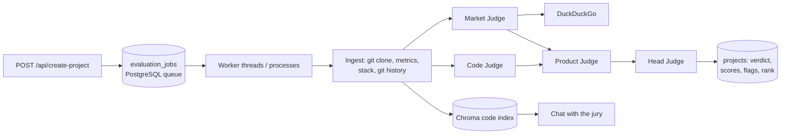

<div align="center">
  <h1 style="margin-bottom: 0.25rem;">Evalio</h1>
  <p style="margin-top: 0; color: #6b7280;">An AI hackathon jury — three specialised judges read the code, research the market and test the product, then a head judge ranks every submission.</p>
  <p>
    
    
    
    
    
  </p>
</div>

---

## Overview

Evalio evaluates hackathon submissions the way a real jury does: each judge owns part of the
scorecard, scores are weighted by the organisers' criteria, and every opinion is backed by evidence.

| Judge | What it actually does | Evidence it produces |
|-------|-----------------------|----------------------|
| 🧑‍💻 **Code Judge** | Clones the repo, indexes every source file, measures tests / CI / docs / tooling / secrets / commit hygiene, then reviews the code with retrieval (RAG). | File paths, engineering scorecard, stack & language breakdown |
| 📈 **Market Judge** | Builds a product profile, plans web searches (DuckDuckGo), and writes a cited landscape: audience, market size, competitors, business model, go-to-market, risks. | Numbered web sources, competitor links |
| 🎨 **Product Judge** | Extracts the features the team claims and verifies each one against the code, probes the demo link, compares originality with competitors and other submissions, and judges theme fit & UX. | Claim checklist (implemented / partial / not found), demo status |
| ⚖️ **Head Judge** | Computes the final score as a **deterministic weighted mean** of the criteria scores, raises integrity flags, writes the verdict and ranks the hackathon. | Flags, ranking, verdict |

Integrity flags include: commits before the hackathon start or after the deadline, 1–2 commit
"code dumps", hard-coded secrets, committed `.env` files, declared stack ≠ detected stack, expected
technologies not used, demo down, unverified claims and near-duplicate submissions.

Each hackathon criterion is routed to the judge best placed to score it (e.g. *Code Quality* → Code
Judge, *Market Potential* → Market Judge, *Innovation* / *UI/UX* → Product Judge). Organisers set
weights per criterion. A missing or private repository scores 0 on code criteria; an infrastructure
failure leaves the criterion unscored so its weight is redistributed.

## Architecture



- **Durable queue** – submissions are queued in PostgreSQL and claimed with `FOR UPDATE SKIP LOCKED`.
  Jobs survive restarts, are retried, and are re-claimed if a worker dies (stale heartbeat).
- **Scale out** – run the API with `RUN_WORKER=false` and start any number of `python worker.py`
  processes; point them at a shared Chroma server with `CHROMA_HOST`.
- **Live progress** – each stage (`ingest → code/market → product → verdict`) writes its status to
  `projects.pipeline`, which the frontend polls.
- **Robust LLM layer** – works with any OpenAI-compatible endpoint; strips reasoning tags, extracts
  JSON tolerant of markdown/trailing commas, validates with pydantic and self-repairs once. Without an
  API key the Code Judge still scores from measured signals.

## Structure

```
server.py              FastAPI app, lifespan (migrations + in-process worker)
worker.py              Standalone worker process
config.py              All settings (env vars)
db.py                  Connection pool, helpers, idempotent migrations
agents/
  base.py              Judge context, shared criterion scoring + rubric
  code_agent.py        Code Judge
  market_agent.py      Market Judge
  product_agent.py     Product Judge
  head_judge.py        Weighted score, integrity flags, verdict
  chat_agent.py        Project-aware chat (panel reports + code retrieval)
pipeline/
  evaluation.py        Orchestrates the jury for one project
  queue.py             PostgreSQL job queue + worker threads
routes/                HTTP endpoints and request/response schemas
services/
  repo_ingest.py       Clone, file filtering, metrics, stack detection, secrets scan, chunking
  vectorstore.py       Chroma collections (per-project code + cross-project search)
  web_search.py        DuckDuckGo search with de-duplication
  criteria.py          Criteria parsing, weights, judge routing
  llm.py               OpenAI-compatible client with JSON repair
```

## Quick start

```bash
cp .env.example .env          # set LLM_API_KEY and database settings
pip install -r requirements.txt
python server.py              # http://localhost:8000 — docs at /docs
```

Requires `git` on the PATH (repositories are cloned shallowly into a temp dir).

With Docker (API + 2 workers + PostgreSQL + Chroma):

```bash
cp .env.example .env
docker compose up --build
```

## Environment

| Variable | Description | Default |
|----------|-------------|---------|
| `LLM_API_KEY` | Key for the OpenAI-compatible endpoint | required for AI judging |
| `LLM_BASE_URL` | Endpoint | `https://openrouter.ai/api/v1` |
| `LLM_MODEL` (or `FREE_LLM_MODEL`) | Model id | `liquid/lfm-2.5-1.2b-thinking:free` |
| `BASE_PROMPT` | Text prepended to every system prompt | – |
| `DB_HOST` / `DB_PORT` / `DB_NAME` / `DB_USER` / `DB_PASSWORD` | PostgreSQL | `localhost` / `5432` / `evalio` / `postgres` / `postgres` |
| `GITHUB_TOKEN` | Clone private repos / avoid rate limits | – |
| `CHROMA_DIR` | Embedded vector store path | `./data/chroma` |
| `CHROMA_HOST` / `CHROMA_PORT` | Use a Chroma server instead | – / `8000` |
| `RUN_WORKER` | Run evaluation workers inside the API process | `true` |
| `WORKER_CONCURRENCY` | Worker threads per process | `2` |
| `REPO_MAX_CHUNKS` | Max code chunks indexed per repo | `1200` |
| `WEB_SEARCH_ENABLED` | Let the Market Judge search the web | `true` |
| `CORS_ORIGINS` | Comma-separated origins (empty = all) | – |

A larger model gives noticeably better judgements; the free default works but is terse.

## API

Interactive docs at `/docs`; the spec is exported to [`docs/spec.yaml`](docs/spec.yaml).

| Method | Path | Description |
|--------|------|-------------|
| `GET` | `/health` | DB / LLM / worker status |
| `POST` | `/api/create-hackathon` | `name`, `description`, `theme`, `technologies`, `criteria` (string or `[{name, weight}]`), `startsAt`, `deadline`, `isAllowed` |
| `PATCH` | `/api/update-hackathon/{id}` | Update any of the above (e.g. close submissions) |
| `GET` | `/api/get-hackathon/{id}` · `/api/get-all-hackathons` | Hackathons with phase and submission stats |
| `GET` | `/api/get-hackathon-leaderboard/{id}` | Ranked projects with judge scores and flags |
| `POST` | `/api/create-project` | `name`, `shortDescription`, `longDescription`, `githubLink`, `demoLink`, `hackathonId`, `projectType` — validated and queued |
| `POST` | `/api/reevaluate/{project_id}` | Run the jury again |
| `GET` | `/api/get-project/{project_id}` | Full report: verdict, criteria, three judge reports, repo snapshot, pipeline |
| `GET` | `/api/get-hackathon-projects/{id}` · `/api/get-all` | Project lists |
| `GET` | `/api/get-project-score/{project_id}` | Final score (0–10), rank, explanation |
| `DELETE` | `/api/delete-project/{project_id}` | Remove a submission and its index |
| `POST` | `/api/review` | `project_id`, `isReviewed` — human review flag |
| `POST` | `/api/search` | `query`, `hackathonId?` — semantic search |
| `POST` | `/api/chat-agent` | `question`, `project_id`, `chathistory` — ask the jury, answers cite files |
| `POST` | `/api/chat-agent/simple` | General judging assistant |
| `POST` | `/api/code-agent/analyze` | Ingest a repo and return its snapshot (no LLM) |
| `POST` | `/api/market-agent/analyze` | Run the Market Judge on an idea |
